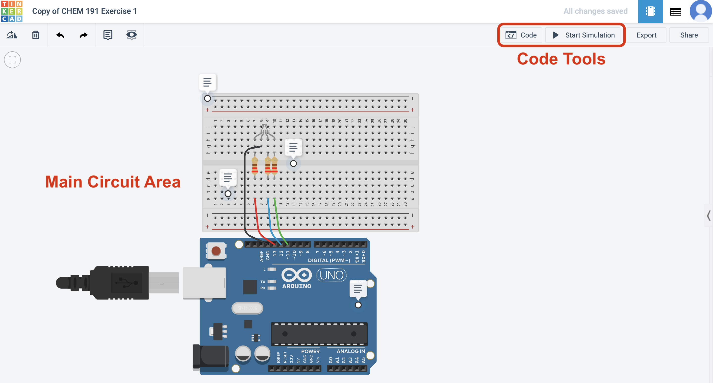

# Getting Started with Tinkercad

**Objective:** Program an Arduino on Tinkercad.  
**To turn in:** I will view your Arduino code through the Tinkercad website.

## Introduction {-}

The last chapter briefly discussed what Arduino is and led you through installtion of the IDE.  This chapter will discuss how to use it and introduce you to programming virtual Arduinos on Tinkercad.

Before an Arduino will work, the user must program it to tell it what to do.  Arduino sketches are written in **C**, perhaps the most common computer language in the world.  These sketches are usually writtin in a software packaged called an *integrated development environment* (IDE) that's available for free on the [Arduino website](http://www.arduino.cc).  The IDE is shown in the figure below.  At the top of the IDE is the menu bar, just like any other program.  The middle part of the IDE is the "text area", and looks like a text editor or simple word processing program.  The text area is where you write the code.  Finally, the black bottom region of the editor is the message area; this is the area where important messages detailing errors and successes will be displayed.  Arduino code is written in the programming language *C* -- probably the most commonly used language in the world -- but the IDE handles some of the programming behind the scenes to make it easier for the user. 

![<small>*Arduino IDE showing an example program (image credit: [Cedar101 [CC0], wikimedia.org](https://commons.wikimedia.org/wiki/File:Arduino_IDE_-_Blink.png))*</small>](images/Arduino_IDE_-_Blink.png)

You'll gain experience using the Arduino IDE in the next exercise.  But this first exercise will introduce you to progamming through an online development environment called Tinkercad.  This environment lets you build circuits and program Arduinos virtually through an online interface.  Tinkercad incorporates the programming language **Scratch**, which is a graphical programming language that allows the user to build a computer program using a drag and drop utility rather than a computer command line interface.  This is often more approachable for many first-time programmers than the text-based C language.

In this exercise, you'll build a virtual Arduino with an LED attached.  The LED will have blue, green, and red lights built in, and you will use Scratch to program the Arduino and control the LED.  When you're done with this exercise, you'll transfer your design and your code to a real Arduino board in lab.

## Getting Started on Tinkercad

1. Go to [tinkercad.com](https://www.tinkercad.com/) and click the green **Join your class** button.
1. Enter the class code (KNRMQXCFCCSU) when prompted.
1. Enter your first name in the Nickname field.
1. Now, anything you create will be visible to you instructor for grading purposes.

## Copy a Default Circuit

1. After logging into the class, go to [https://www.tinkercad.com/things/fLDK0dntile-chem-191-exercise-1](https://www.tinkercad.com/things/fLDK0dntile-chem-191-exercise-1) and click the **Copy and Tinker** button.  The circuit used for this assignment will automatically be copied to your class user page and your code will be visible to your instructor.
    > *The notes on the circuit can be expanded and will explain what each part is.*

## Program the Arduino

1. Click the **Code** button at the top right of the Tinkercad window.  The code pane will slide out.

  

1. In the pane that slides out, click the **Blocks** dropdown and select **Blocks + Text**.  This will allow you to see both the Scratch code and the Arduino code (which is generated by the Scratch code automatically).  See the image below for more clarification.

  
  
1. Click on **Output** at the top of the *Scratch Functions* area and find the module that says `set pin __ to __`.  Drag that block into the *Scratch Code* area.

1. In the new code module, set the pin to `13`, one of the pins the Arduino is attached to, and have the code set the pin to `HIGH`.
   
    > *`HIGH` means "on" and `LOW` means "off" in Arduino speak.*

1. Click on **Control** at the top of the *Scratch Functions* area and find the module that says `wait __ __`. Drag that block into the *Scratch Code* area.

1. Put in `1` and select `secs`.  This will make the code pause for 1 second after the light turns on.

1. Turn the light off by clicking on **Output** at the top of the *Scratch Functions* area, finding the module that says `set pin __ to __`, dragging it block into the *Scratch Code* area, and selecting `13` and `LOW`.

    > *Notice how the Arduino code changes as you change the Scratch code!*

## Run the Program

1. Press **Start Simulation**.  You should see the LED blink on and off.

## To Turn In:

1. Make sure you complete this exercise and leave the code in your Tinkercad dashboard for the semester.  Your instructor will take a look at your code and give you a grade for it within in the next week or so.
  