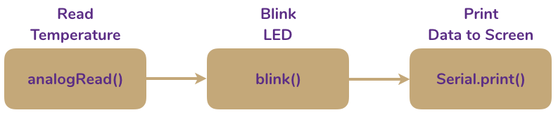

--- 
title: 'CHEM 191 Workbook: Building a Teensy Air Quality Monitor'
author: "Al Fischer"
date: "Western Carolina University"
output:
  html_document:
    df_print: paged
description: 'Course Materials for CHEM 191: Issues in Environmental Chemistry'
documentclass: book
link-citations: yes
bibliography: book.bib
output_dir: docs
site: bookdown::bookdown_site
biblio-style: apalike
---
--- 
title: 'CHEM 191 Workbook: Building a Teensy Air Quality Monitor'
author: "Al Fischer"
date: "Western Carolina University"
output:
  html_document:
    df_print: paged
description: 'Course Materials for CHEM 191: Issues in Environmental Chemistry'
documentclass: book
link-citations: yes
bibliography: book.bib
output_dir: docs
site: bookdown::bookdown_site
biblio-style: apalike
---

# {-}

<center>

</center>

<small>
*Copyright 2019 Al Fischer.  This work is released under the [CC-BY-NC-SA 4.0 license](https://creativecommons.org/licenses/by-sa/4.0/).  You are free to share, adapt, and reuse this material for non-commercial purposes but you MUST attribute the author and you MUST release the work under the CC-BY-NC-SA 4.0 license. NOTE: This workbook is currently in DRAFT status.*
</small>

<!--chapter:end:index.Rmd-->


# Preface {-}

Placeholder


## What is Arduino? {-}
## OK, but what is Teensy? {-}
## Using this Book {-}
### Code {-}
### Notes and Warnings {-}
## Is this work dangerous? {-}
## Additional Resources {-}

<!--chapter:end:00_preface.Rmd-->


# Getting Started with Arduino

Placeholder


## Introduction {-}
## Install the Arduino IDE
## Install Teensyduino
## Test the Teensy!
### Check the board
### Check the software

<!--chapter:end:01_getting-started.Rmd-->


# Blink an LED

Placeholder


## Introduction {-}
### How are things connected to a Teensy? {-}
### The solderless breadboard {-}
### What is a program? {-}
## Connecting the LED
## Program the Teensy
### One Color
### Three Colors
### Make Your Own Changes
### Turn in

<!--chapter:end:02_Blink.Rmd-->


# Voltage and Communication

Placeholder


## Introduction {-}
### Electricity {-}
### Communicating via the serial port {-}
## Connect the Temperature Sensor
## Program the Teensy

<!--chapter:end:03_Voltage.Rmd-->

# Functions: Building Blocks for Programs

**Objective:** 
**To turn in:** 

## Introduction {-}

In previous exercises discussed the two function, `setup()` and `loop()` that are necessary for every Arduino sketch.  You've also (perhaps unknowingly) used pre-defined functions to achieve tasks.  In programming, a **function** is a defined piece of reusable code that can be used to perform an action.  You could think of functions as modules that can be stacked together to create a program.  For example, the items `digitalWrite()` and `Serial.print()` are both functions.  The first, as we've seen, controls the logic level of a digital I/O pin on the Teensy while the latter prints data to the serial port.

Note that functions all have a defined stucture, or *syntax*.  This may vary from language to langages, but will be the same within any language.  In Arduino (C), functions always take the form `function(argument_1, argument 2, ...);`, where `function()` is the function and `argument_1`, etc., are the entities the function acts on or uses in some way while executing the function.  This is very similar to functions in mathmatics.  Assume, for example:

$$
f(x) = 3x \\
$$

Here, we've defined a function, $f$, that acts on argument $x$.  If we write $f(2)$, we are saying we wish to substitute 2 for x in the function, yielding $f(x) = 3 \times 2 = 6$.

We could just as easily do this in Arduino.  Using the same example, we can define a function `f()`:

```{Rcpp, eval = FALSE}
  int f(int x) {
    return 3*x
  }
```

This function is equivalent to the mathmatical expression above.  First, we define a function `f()` that takes one argument, `x` (contained within the parentheses).  Within the function (denoted by the curly braces), we ask Arduino to output, or **return**, $3 \times x$.  After defining the function, we could write `f(2)` and Arduino would output `6`.

> *What would Arduino output if you wrote `f(4)`?

### Using Functions

Although most of the work done in this class will rely on pre-written functions, You'll explore the methods for writing your own function in this exercise to help you understand how they work.  As mentioned above, you can think of function as modules or building blocks that can be combined to create desired outcome.  For example, if you wished to create a program that flashed a light everytime the temperature was read and then displayed the result to the screen, you might wish to combine blocks for reading the temperature, flashing a light, and printing data to the computer screen:



Creating the **block diagrams** can be very helpful in visualizing what a program will do, and just the process of creating one can help you think through what the program needs to achieve line-by-line.  The program above has one problem: it assumes there is a function called `blink()` that will flash the LED.  This is not true, but you'll make one in this exercise.  A list of built in functions can be found on the [Arduino website](https://www.arduino.cc/reference/en/); other functions specific to this class can be found in [Appendix C][Appendix C: Functions].

## Writing a `blink()` Function

1. Create a function that would blink and LED on and off.  Your function should:
  - Be called `blink()`.
  - Turn the LED on for a set amount of time.
  - Turn the LED off for a set amount of time.

2. 

## Using Functions


<!-- # Steps to a Successful Project -->

<!-- 1. Define your objective. -->
<!-- 2. Write the algorithm. -->
<!-- 3. Select the hardware. -->
<!-- 4. Write the code. -->
<!-- 5. Wire the project. -->
<!-- 6. Test and debug. -->

<!--chapter:end:04_Functions.Rmd-->

# Soldering and PCB Assembly

**Objective:**
**To turn in:** 

- schematic diagrams

<!--chapter:end:05_Soldering.Rmd-->

# Testing and Calibration

**Objective:**
**To turn in:** 

<!--chapter:end:06_Calibration.Rmd-->

# Appendix A: Arduino Cookbook {-}

## Recipe 1 {-}

Blink

<!--chapter:end:10_Cookbook.Rmd-->


# Appendix B: Gory Details {-}

Placeholder


## Using the Snooze Library {-}
## Using the RTC {-}
## Char[] vs. String {-}

<!--chapter:end:11_Details.Rmd-->


# Appendix C: Functions {-}

Placeholder


## getTeensy3Time() {-}
## setBMESamplingParameters() {-}
## initializeBoard() {-}
## pmStartMeasurement() {-}
## pmStopMeasurement() {-}
## writeFile(char filename[16]) {-}
## blink() {-}
## fillDigits(int digits) {-}
## printTime(int h, int m, int s) {-}
## printDate(int y, int m, int d) {-}
## printDateTime(String d, String t) {-}
## printData() {-}
## createFileName(int y, int m, int d) {-}

<!--chapter:end:12_Functions.Rmd-->

# Appendix D: Strategies for Troubleshooting {-}

<!--chapter:end:13_Untitled.Rmd-->


# Glossary and Abbreviations {-}

Placeholder


### Current (*i*) {-}
### Electricity {-}
### LED {-}
### Power (*P*) {-}
### Resistance (*R*) {-}
### Voltage (*V*) {-}

<!--chapter:end:14_Glossary.Rmd-->

