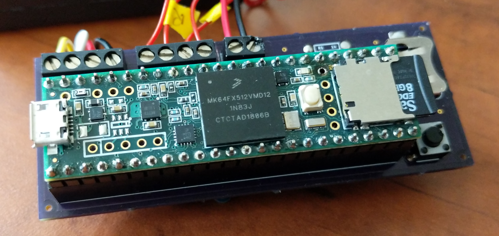

--- 
title: 'CHEM 191 Workbook: Building a Teensy Air Quality Monitor'
author: "Al Fischer"
date: "Western Carolina University"
output:
  html_document:
    df_print: paged
description: 'Course Materials for CHEM 191: Issues in Environmental Chemistry'
documentclass: book
link-citations: yes
bibliography: book.bib
output_dir: docs
site: bookdown::bookdown_site
biblio-style: apalike
---

# {-}

<center>

</center>

<small>
*Copyright 2019 Al Fischer.  This work is released under the [CC-BY-NC-SA 4.0 license](https://creativecommons.org/licenses/by-sa/4.0/).  You are free to share, adapt, and reuse this material for non-commercial purposes but you MUST attribute the author and you MUST release the work under the CC-BY-NC-SA 4.0 license. NOTE: This workbook is currently in DRAFT status.*
</small>

<!--chapter:end:index.Rmd-->

# Preface {-}

## What is Arduino? {-}

Over the course of the semester, we will build air quality monitors using the Teensy microcontroller platform.  This platform is an offshoot of the popular Arduino microcontrollers, and they are very similar.  This workbook will introduce you to the basics of Arduino and Teensy, and walk you through assembling and programming your air quality sensor.

**Arduino** is an [open-source](http://www.wikipedia.com/wiki/Open-source) platform for developing interactive electronic devices.  Arduinos of various flavors are used for all variety of things, from controlling motors and lights to reading data from sensors.  Exercise 1 will provide a more thorough overview of Arduino.

## OK, but what is Teensy? {-}

Teensy is an offshoot of Arduino.  It is capapble of most everything an Arduino can do and often much more.  You might think of it as the supercar version of an Arduino.  Aside from being more capable, it's also smaller -- a fact that gives rise to it's name (Teensy).  In this class, the names Teensy and Arduino will be used interchangeably.  Exercise 1 will provide a more thorough overview of Teensy.

## Using this Book {-}

Some common typographical (formatting) conventions will be used throughout this book.  
### Code {-}

The exercises will make extensive use of computer code, which will always be represented with `monospace` font with a grey background.  It may be `inline` or 

```
offset.
```

When you see code, you should take time to thoroughly digest it.  Sometimes the code may work as-is; other times you may have to add to the code to make it work.  And other times the code may be `pseudocode`, which is example code that looks like it would work but will not actually compile.  The code will often be color-coded to highlight various features of the programming language.

### Notes and Warnings {-}

This book will also make use of notes and warnings.  Examples are below.

> *A note is written in a quote box with italic font and represents background information or a bit of knowledge to think about.*

> A NOTE ALL CAPITAL LETTERS REPRESENTS A SAFETY WARNING.  YOU **MUST** PAY ATTENTION TO THESE WARNING OR YOU MAY BREAK EQUIPMENT AND/OR HARM YOURSELF OR YOUR CLASSMATES.

## Is this work dangerous? {-}

Although electricity can be very dangerous and even lethal, the work we'll do in this class shouldn't pose any particular danger if done carefully.  There are two important factors to consider when deciding how dangerous an electrical device is: (1) the voltage and (2) the current.  Generally speaking, it takes both to be dangerous.  Most of the voltage in these exercises will be either 3.3V or 5V, with currents on the order of 100 mA. These are relatively low voltages and low currents, are safe to work with, and do not pose a shock hazard.  That said, connecting things incorrectly can still break components, cause them to get very hot (they might burn you), or even go up in smoke -- be careful and double check yourself/your lab partner when connecting things!

## Additional Resources {-}

There are myriad books, blog posts, and websites about Arduino, but few specifically deal with the Teensy version.  This workbook and the [Teensy website](http://www.pjrc.com) are your best resources regarding Teensy-specific items.  The code used to program the Teensy (and Arduinos) is a version of `C`; knowing that will be useful when trying to find help online.  The [Arduino language reference](https://www.arduino.cc/reference/en/) provides a list of available functionalities and syntax.

If you want more general information on programming Arduinos, the Arduino IDE, or electronics, you may check some of the following:

- Monk, Simon.  [***Programming Arduino: Getting Started with Sketches***](https://www.amazon.com/Programming-Arduino-Getting-Started-Sketches/dp/0071784225).  
- Scherz, Paul and Simon Monk. [***Practical Electronics for Inventors***](https://www.amazon.com/Practical-Electronics-Inventors-Fourth-Scherz/dp/1259587541/ref=pd_lpo_sbs_14_t_0?_encoding=UTF8&psc=1&refRID=9JN842FPFMNAA9RQV8X3).  
- The Arduino [forum](https://forum.arduino.cc/).  
- Boxall, John.  [***Arduino Workshop***](https://www.amazon.com/Arduino-Workshop-Hands-Introduction-Projects/dp/1593274483).

<!--chapter:end:00_preface.Rmd-->

# Getting Started with Arduino

**Objective:** Install Arduino and Teensyduino  
**To turn in:** Nothing! Make sure your software is installed and working so you're ready for the next class period.

## Introduction {-}

**Arduino** is an [open-source](http://www.wikipedia.com/wiki/Open-source) platform for developing interactive electronic devices.  More specifically, Arduinos are [*microcontrollers*](https://en.wikipedia.org/wiki/Microcontroller), which are essentially small computers that can be programmed to perform a specific task over and over again.  Microcontrollers are ubiquitous in the modern world and are embedded in scientific equipment, cars, cell phones, and nearly every other electronic device.  Arduino provides a simple, standardized interface for microcontrollers, which has led it to become a very popular tool for hobby projects, citizen science tools, and even art installations.  Arduino began in 2005 as a student project at the Interaction Design Institute Ivrea in Ivrea, Italy. 


)*</small>](https://upload.wikimedia.org/wikipedia/commons/3/38/Arduino_Uno_-_R3.jpg)

Using an Arduino requires a *program*, or a set of commands that are uploaded to the Arduino to have it perform the desired task. In the Arduino community, the term *sketch* is used synonymously with program.  Examples of possible programs include having the Arduino **measure** things like temperature, light, or humidity, or **control** things like lights or motors.  You could even have it measure the temperature and turn on a heater when it gets too cold.  Although an Arduino can run as a stand-alone device once setup, it must first be programmed by a computer. 

To program the Arduino, we'll use the a piece of software called an *integrated development environment* (IDE) that's available for free on the [Arduino website](http://www.arduino.cc).  The IDE is shown in the figure below.  At the top of the IDE is the menu bar, just like any other program.  The middle part of the IDE is the "text area", and looks like a text editor or simple word processing program.  The text area is where you write the code.  Finally, the black bottom region of the editor is the message area; this is the area where important messages detailing errors and successes will be displayed.  Arduino code is written in the programming language *C* -- probably the most commonly used language in the world -- but the IDE handles some of the programming behind the scenes to make it easier for the user. 

![<small>*Arduino IDE showing an example program (image credit: [Cedar101 [CC0], wikimedia.org](https://commons.wikimedia.org/wiki/File:Arduino_IDE_-_Blink.png))*</small>](https://upload.wikimedia.org/wikipedia/commons/a/a1/Arduino_IDE_-_Blink.png)

Part of the beauty of Arduino is its open-source nature.  Many spin-offs and flavors of Arduino exist due to it's open-source nature, each with its own unique benefits.  In this class, we'll use a variant of Arduino called the ***Teensy*** (specifically Teensy 3.5).  The Teensy is programmed in the same way as an Arduino, but has a smaller form-factor and more capabilities than a standard Arduino.  The picture below shows a Teensy 3.5 and the functions of each connection on the Teensy.  Seeing all the functions laid out like that can be overwhelming, but we'll walk through the ones we need to use step-by-step in future exercises.

).*</small>](https://www.pjrc.com/teensy/card8a_rev2.png)

This exercise will walk you through installation of the Arduino IDE, the software for the Teensy (Teensyduino), and an initial check of the board.

## Install the Arduino IDE

> *You MUST follow the order of the instructions here or Teensyduino will not work!*

1. Use a web browser to navigate to [https://www.arduino.cc/en/Main/OldSoftwareReleases#previous](https://www.arduino.cc/en/Main/OldSoftwareReleases#previous).
1. Download the installer for version **1.8.6**.  You must choose the installer appropriate for your operating system.
1. Choose **Just Download** to download the software, or make a donation if you're feeling generous!
1. Open the file that downloads and run the installer.
1. Open the Arduino program to make sure it runs and to prepare for the next steps.

## Install Teensyduino

1. Use a web browser to navigate to [https://www.pjrc.com/teensy/td_download.html](https://www.pjrc.com/teensy/td_download.html).
1. Download the correct installer for your operatring system.  Note that steps 1 and 2 on the Teensy page should have been completed when you installed the Arduino IDE, above.
1. Run the installer.  When prompted:
  1. Select the `Arduino/` folder for the install location.  If **Next** is greyed out you probably downloaded the wrong version of the Arduino IDE.
  1. Select **All** when asked which additional libraries to install.
  
## Test the Teensy!

### Check the board
1. Plug your Teensy into the computer via the USB connection.

    > BE ***EXTREMELY*** CAREFUL WITH THE USB CONNECTION ON THE TEENSY.  THEY BREAK ***VERY*** EASILY!!

1. You should see the orange LED blinking on the Teensy.  If you do not, something is wrong with your Teensy and you should notify your instructor.

### Check the software
1. Open the Arduino IDE.
1. Click `Tools > Board > Teensy 3.5`
1. Click `File > Examples > 01.Basics > Blink`.
1. Find the part in the program that says `delay(1000)` and change it to `delay(500)`.
1. Click **Verify** in the software (checkmark button in upper left corner).
1. Press the white button on the top of the Teensy.
1. Press upload in the software (right arrow button, next to checkmark).
1. You should see the orange LED blink more quickly.  If you encountered any errors, something could be wrong with your software installation or you may have made a typo in the code.  Notify your instructor of any problems.

<!--chapter:end:01_getting-started.Rmd-->

# Blink an LED

**Objective:** Use Arduino to turn an LED on and off.    
**To turn in:** Your working Arduino code and the [Lab 2 Worksheet](https://github.com/alphonse/alphonse.github.io/raw/master/CHEM191/pdf/lab2_Blink.pdf).

## Introduction {-}

This exercise will explore two concepts: (1) connecting devices to the Arduino and (2) the structure of the Arduino program used to *control* those devices.  As a first example, we'll connect an LED (light-emitting diode) to the Teensy and write a program to turn it on and off.

### How are things connected to a Teensy? {-}

The Teensy can control all sorts of devices, including lights, motors, and various sensors.  The device to be controlled must be connected to one of the Teensy's *pins*. You can think of a pin as a unique port or connection on the Teensy.  Pins can send and receive information, so communication between the pin and the sensor goes both ways.  One pin might be used to control a heater, while another might be used to read data from a temperature sensor.  The pins that are available on the Teensy are shown in the figure below.  Some pins provide power (3.3 V), some pins provide a connection to the circuit ground (GND), and some function to send and receive data.  A lot of pins have several functions, each represented by a different color rectangle on the diagram.    Note, though, that each pin can only have one function at any given time.  For now, we'll just focus on the pin numbers.  Those labeled 0-33 (shown in grey) are called *digital pins*; they function as both inputs (to receive data, or sense) and outputs (send data, or control), but we'll use just the output functionality in this exercise.

).*</small>](https://www.pjrc.com/teensy/card8a_rev2.png)

There are several ways to connect something to the pins of the Teensy.  One way is to directly solder wires to them, in which a soft metal alloy is melted onto two the wire and the Teensy pins as they are connected to make a permanent, metal connection.  This is best saved for a final, fully vetted design that won't ever need to be changed.  We'll use another method for this exercise called a solderless breadboard.

### The solderless breadboard {-}

A breadboard is shown in the figure below.  The holes in the breadboard are spaced in such a way that a Teensy can be plugged directly into the board.  Columns, labelled A, B, C, ..., are connected across the board electrically, such that A1 and B1 are connected; rows are insulated from each other, such that A1 and A2 are not connected.  The connections labeled with red and blue lines on each edge are connected together and are sometimes called rails; they provide an easy way to distribute power (e.g. the red rail) and ground (e.g. the blue rail) connections around the board.  If that seems confusing, try watching this video [this video](https://www.youtube.com/watch?v=mLOxoK1zj9A).


### What is a program? {-}

A *program*, or *sketch* in Arduino jargon, is a set of commands stored on the Teensy that tell it what to do.  Although a Teensy can do most anything a computer would do, it can only run a single program over and over.  For example, this exercise involves programming the Teensy to turn an LED on and off so that it blinks.  Other options would be to collect data from a temperature sensor, or turn a motor on a off to move a robot (or to do all of those things at once).

An Arduino program always consists of two parts: (1) a `setup()` function and (2) a `loop()` function (more details about what a function is will come in future exercises).  The `setup()` function runs once every time the Teensy is powered on.  After that, the Teensy runs the `loop()` function over and over until it's turned off.  Usually, some initial lines of code are included above the `setup()` function provide definitions used throughout the program.  A "bare minimum" program with the `setup()` and `loop()` functions is shown below.  Note that this program does nothing other than run.

```{Rcpp, eval = FALSE}
    void setup() {
      // anything written here will execute exactly once on startup
    }
    
    void loop() {
      // anything written here will execute over and over indefinitely until the power is turned off
    }
```

Arduino sketches (programs) are written with the Arduino IDE (see Chapter 1).  To begin, you open the IDE and write your code in the text area of the program.  When your're done writing your code, you compile it and upload it to the board to run it.  If it compiles and uploads correctly, you will see a "Success" message in the message are of the IDE; if not, you'll see an error message and will need to troubleshoot your code.

You should use comments when writing your program to clairfy what each part does.  Comments are not read by the compiler/board, and do not execute.  In other words, they are only to help humans reading the code understand it more easily.  To add a comment, just use the ``\\`` symbol; anything after that symbol won't be read by the program.  For example, you can make an entire line a comment, like the first line below.

```{Rcpp, eval = FALSE}
    // Pin 13 has the LED on Teensy 3.0
    int led = 13;
```

You could also make a portion of a line a comment, like the second half of the line below.

```{Rcpp, eval = FALSE}
    int led = 13; // Pin 13 has the LED on Teensy 3.0
```

Finally, note that every line in the program *must* end with a semi-colon, `;`.

In the exercise, we'll connect an 3-color LED to a Teensy and write a sketch to control it.

## Connecting the LED

1. Push your Teensy into the breadboard provided and connect the USB cable.  Try not to bend the pins as you push it in.  Refer to the diagram below if necessary.

    > REMEMBER, BE ***EXTREMELY*** CAREFUL WITH THE USB CONNECTION ON THE TEENSY.  THEY BREAK ***VERY*** EASILY!!

2. Push the LED into the breadboard such that none of the leads (wires) are connected to anything else (each one is in it's own row).  Make sure you note which row the longer lead goes into.

    > *Always work with the Teensy unplugged from the computer.  This will help ensure no "magic smoke" escapes.*

3. Use a jumper wire to connect the **longer lead** on the LED to the **GND** pin on the Teensy.
1. Use 3 more jumper wires to connect the remaining three leads to pins **13, 14, and 15**.


## Program the Teensy

### One Color

1. Open the Arduino IDE and load the Blink example (`File > Examples > 0.1 Basic > Blink`)
1. Go to `File > Save As` to save the example under a new name in the default location (`Documents/Arduino`).  Call it **lastnameFirstname_blink.ino**.

    > *Remember, files that don't follow the naming convention **exactly** will incur point deductions.*

3. You should see the following at the top of the sketch:

```{Rcpp, eval = FALSE}
    // Pin 13 has the LED on Teensy 3.0
    // give it a name:
    int led = 13;
```

  Remember, anything following a `//` is a comment; it does not affect the Arduino program.  Get in the habit of using comments to describe what each line of code does.
  
  The line `int led = 13` defines the name of pin 13 as `led`.  This name could be anything you wish.  In this case, `led` is useful because the LED is connected to pin 13.

4. Next is the `setup()` function.  In this case, the only setup necessary is to set the mode of the `led` pin as an output.

```{Rcpp, eval = FALSE}
  // the setup routine runs once when you press reset:
  void setup() {                
    // initialize the digital pin as an output.
    pinMode(led, OUTPUT);     
  }
```

5. Finally, the `loop()` function, which runs over and over.
```{Rcpp, eval = FALSE}
  digitalWrite(led, HIGH);   // turn the LED on (HIGH is the voltage level)
  delay(1000);               // wait for a second
  digitalWrite(led, LOW);    // turn the LED off by making the voltage LOW
  delay(1000);               // wait for a second
```

6. Assuming all those sections look good, press the **Upload** to button (right arrow in top left) to save, compile, and upload your sketch.

### Three Colors

You should have seen a single color blinking on and off.  Now, make some modifications so that all three colors blink on and off.

1. Define the two extra pins.  In this case, it could be useful to refer to them by color.

```{Rcpp, eval = FALSE}
    int blue = 13;   // blue pin connected to pin 13
    int green = 14;  // green pin connected to pin 14
    int red = 15;    // red pin connected to pin 15
```

> *Have you saved your work yet?  The IDE doesn't autosave, so make sure you save it **frequently**!*

2. Set each of those to outputs in the `setup()` function.  You will have to fill in the blanks for the red and green pins below.
```{Rcpp, eval = FALSE}
  // the setup routine runs once when you press reset:
  void setup() {                
    pinMode(blue, OUTPUT);     // initialize the blue pin as an output.
    pinMode(____, OUTPUT);     // initialize the green pin as an output.
    ______________________     // initialize the red pin as an output.
  }
```

3. Finally, add the extra colors to the `loop()` function.

```{Rcpp, eval = FALSE}
  // blue
  digitalWrite(blue, HIGH);   // turn the LED on (HIGH is the voltage level)
  delay(1000);                // wait for a second
  digitalWrite(blue, LOW);    // turn the LED off by making the voltage LOW
  delay(1000);                // wait for a second
  
  // green
  digitalWrite(green, HIGH);   // turn the LED on (HIGH is the voltage level)
  delay(1000);                 // wait for a second
  digitalWrite(green, LOW);    // turn the LED off by making the voltage LOW
  delay(1000);                 // wait for a second
  
  // red
  digitalWrite(red, HIGH);     // turn the LED on (HIGH is the voltage level)
  delay(1000);                 // wait for a second
  digitalWrite(red, LOW);      // turn the LED off by making the voltage LOW
  delay(1000);                 // wait for a second
```

4. Make sure you show your code and blinking LED to your instructor before you move on.

### Make Your Own Changes

1. Before you leave, modify your code to change the blink pattern.  You can change the sequence of the colors, the time between blinks, the number of blinks, or the amount of time each color is on.
1. Save your final code and turn it in to Dropbox.

<!--chapter:end:02_Blink.Rmd-->

# Going Deeping into Electronics and Programming

**Objective:** Measure a temperature with Teensy and display the result to the computer screen using serial communication.
**To turn in:** 

## Introduction {-}

In the last exercise you used a Teensy to turn a light on and off, although we did not discuss what was happening electrically. This exercise will explore the electrical workings of the Teensy and walk you through how to write code to *sense* signals from a device.  More specifically, you'll investigate (1) the concept of **voltage** while sensing temperature and (2) communicating .

### Electricity {-}

When first learning about electricity, it may help to think of it in analogous terms to water.  **Current** is the flow of electricity through a circuit, and is analogous to the current in a river.  Just like water molecules move through the river, charge carriers (electrons) in a move through the wires of the circuit.  **Voltage** is a *potential energy difference* between two points in a circuit.  This is analogous to the potential energy difference in water stored behind a dam and water at the bottom of the dam.   Current will not flow without a voltage difference, just as water will not flow without a difference in height or pressure.

Recall that in the last exercise you turned an LED on and off using a pin on the Teensy.  You did this by alternately setting the pin to `HIGH` and `LOW`, as in:

```{Rcpp, eval = FALSE}
    digitalWrite(13, HIGH);
    delay(1000);
    digitalWrite(13, LOW);
    delay(1000);
```

But what did this do internally in the Teensy?  When the Teensy gets the command `digitalWrite(13, HIGH);` it sets the voltage of pin 13 to 3.3 volts (3.3 V is standard voltage for microcontrollers).  Alternatively, when it gets the command `digitalWrite(13, LOW);`, it sets the voltage to 0 V.  Thus, when the voltage is 3.3 V, there is a potential difference across the LED from 3.3 V on the controlling pin (anode) to 0V on the ground pin (cathode).  This causes current to flow through the LED, which in turn causes the LED to light up.  When the voltage is set back to 0, there is no longer a potential difference across the LED, current does not flow, and the LED does not light up.

You may have gotten the idea that voltage and current are inextricably linked, and that's true.  In fact, **Ohm's Law** provides a mathmatical relation between the two:

\[
\text{Voltage (volts)} = \text{Current (amps)} \times \text{Resistance (ohms, }\Omega\text{)}  \\
V = iR
\]

This introduces a new concept, resistance.  **Resistance** is simply the opposition to flow of electrical current.  Resistance can be introduced to a circuit purposely with a device called a **resistor**.  Usually these are a defined, fixed resistance introduced for a specific purpose.  However, many sensors have a resistance that changes proporitionally to some stimulus.  Thus, the voltage across the device will change in response to that stimulus, and the stimulus can be measured simply by measuring the voltage.  As an example of how useful this is, consider a temperature sensor.  A computer or microcontroller cannot sense the temperature directly -- it only understands voltages.  A device that converts changes in temperature to changes in voltage allows the computer to infer changes in temperature.

Although the voltage output from the Teensy pin was either HIGH or LOW, the voltage output from the temperature sensor can be any value.  A signal that can be only HIGH or LOW (i.e. on or off, 1 or 0), is called a **digital signal**.  Digital signals are often used to communicate between computers and to control many devices because they are relatively immune to outside noise.  Many sensors, on the other hand, produce signals that vary *continuously*, and such signals are called **analog signals**.  

The Teensy can read *digital* signals on any of its digital I/O (input/output) pins (grey labels on the pinout diagram).  The Teensy can read *analog* signals on any of the analog input pin, which are shown with orange labels in the pinout diagram and numbered A0 through A22 (the A stands for analog).

### Communicating via the serial port {-}

In the previous exercise, you used digital signals to control an LED, but there was no communication between the Teensy and computer after the sketch was uploaded.  When reading signals, it's often useful to display the reading on the computer screen to have real-time feedback from the program.  To do this, the data collected on the Teensy board must be sent to the computer, the computer must read the data, and the computer must display it on the screen.  The communication protocol used to do this is called **serial communication**.  This is a very widely used protocol, and most computers used to come with a serial port built in.  In our case, we'll conduct serial communication over the USB port.

Using serial communication on the Teensy is relatively simple.  The first step is to open the serial port and tell it what data transfer speed to use (basically how quickly the Teensy and the computer talk to each other).

```{Rcpp, eval = FALSE}
    Serial.begin(9600);
```

Once the connection is open, you can print most anything to the serial port you wish.  For example, a simple [hello world](https://en.wikipedia.org/wiki/%22Hello,_World!%22_program) program would look something like:

```{Rcpp, eval = FALSE}
    Serial.begin(9600);
    Serial.print("Hello, World!");
```

The above pseudocode would print "Hello, World!" to the computer's serial port.  The result could be displayed on the computer screen by opening the serial monitor in the Arduino IDE.  There are a few more details you'll learn as you go.

In this exercise, you'll measure ambient temperatures using a temperature sensor and display the result to the computer screen via the serial port.

## Connect the Temperature Sensor

## Program the Teensy


<!--chapter:end:03_Voltage.Rmd-->

# Functions

**Objective:** 
**To turn in:** 

## Introduction {-}

The algorithm.

## Writing a `blink()` Function

## Using Functions


<!-- # Steps to a Successful Project -->

<!-- 1. Define your objective. -->
<!-- 2. Write the algorithm. -->
<!-- 3. Select the hardware. -->
<!-- 4. Write the code. -->
<!-- 5. Wire the project. -->
<!-- 6. Test and debug. -->

<!--chapter:end:04_Functions.Rmd-->

# Soldering and PCB Assembly

**Objective:**
**To turn in:** 


<!--chapter:end:05_Soldering.Rmd-->

# Testing and Calibration

**Objective:**
**To turn in:** 

<!--chapter:end:06_Calibration.Rmd-->

# Appendix A: Arduino Cookbook {-}

## Recipe 1 {-}

Blink

<!--chapter:end:10_Cookbook.Rmd-->

# Appendix B: Gory Details {-}

## Using the Snooze Library {-}

The Snooze library for Teensy allows us to put the Teensy into a hibernation mode, wherein it uses very little power.  The Snooze library and it's documentation can be found here: [https://github.com/duff2013/Snooze]().

The library allows for numerous wakeups, including checking if a button is pressed, using a delay, and checking for a voltage threshold to be crossed among other options.   We'll use the real-time clock (RTC) wakeup for this project.  The RTC wakeup allows the user to wake the Teensy up after a defined amount of time, as counted in hours, minutes, and/or seconds by the RTC on the Teensy.

The first step to using Snooze is to call the library, load the alarm driver, and configure the SnoozeBlock to use the alarm driver.  All of this goes *before* the `setup()` portion of the program.

```{Rcpp, eval = FALSE}
#include <Snooze.h>
SnoozeAlarm alarm;
SnoozeBlock config_teensy35(alarm)
```

Then, we set the RTC timer for the desired snooze period (in the `setup()` function).  In the example below the Teensy will wake up after 5 minutes.

```{Rcpp, eval = FALSE}
alarm.setRtcTimer(0, 5, 0); // h, m, s
```

Finally, we put the Teensy into hibernation mode `loop()` function.  Other options exist, such as deep sleep and sleep, but hibernate uses the least power.

```{Rcpp, eval = FALSE}
int who;
who = Snooze.hibernate(config_teensy35);
```

The Snooze function will return the pin number that caused the Teensy to wake up.  The RTC wakes the Teensy up on pin 35.  To know when that's happened, we just wait until `who` is set to 35.

```{Rccp, eval = FALSE}
if (who == 35) {
  # do something here
}
```

## Using the RTC {-}

- The Teensy 3.5 has an oscillator onboard.  The battery is included on the WheeCAIR PCB.
- The coin cell (CR 1225) battery allows the RTC to keep time even when the board is not plugged in.
- The RTC is not temperature compensated so it may drift over time.
- The RTC runs during hibernation at full functionality.  However, the Time library needs to resync everytime the Teensy wakes up using `setSyncProvider(getTeensy3Time);`

## Char[] vs. String {-}

<!--chapter:end:11_Details.Rmd-->

# Appendix C: Functions {-}

## getTeensy3Time() {-}

This function comes from the RTC example.

```{Rcpp, eval = FALSE}
time_t getTeensy3Time() {
  return Teensy3Clock.get();
}
```

## setBMESamplingParameters() {-}
```{Rcpp, eval = FALSE}
void setBMESamplingParameters() {
  if (!bme.begin(0x76)) {
    return;
  }
  // Set up oversampling and filter initialization
  bme.setTemperatureOversampling(BME680_OS_8X);
  bme.setHumidityOversampling(BME680_OS_2X);
  bme.setPressureOversampling(BME680_OS_4X);
  bme.setIIRFilterSize(BME680_FILTER_SIZE_3);
  bme.setGasHeater(320, 150); // 320*C for 150 ms
}
```

## initializeBoard() {-}
```{Rcpp, eval = FALSE}
void initializeBoard() {
  pinMode(33, OUTPUT);
  digitalWrite(33, HIGH);
  setSyncProvider(getTeensy3Time);
  if (!SD.begin(chipSelect)) {
    return;
  }
  if (!card.init(SPI_HALF_SPEED, chipSelect)) {
        // don't do anything more:
        while (1) {
            blink();
            blink();
        }
    }
}
```

## pmStartMeasurement() {-}
```{Rcpp, eval = FALSE}
bool pmStartMeasurement() {
    Serial1.begin(9600);
    delay(500);
    bool pmStatus = my_hpm.stop_autosend();
    pmStatus = my_hpm.start_measurement();
}
```

## pmStopMeasurement() {-}
```{Rcpp, eval = FALSE}
bool pmStopMeasurement() {
    bool pmStatus = my_hpm.stop_measurement();
    delay(500);
    Serial1.end();
}
```

## writeFile(char filename[16]) {-}
```{Rcpp, eval = FALSE}
void writeFile(char filename[16]) {
    File dataFile = SD.open(filename, FILE_WRITE);
    if (dataFile) {
        dataFile.print(printDateTime(printDate(year(), month(), day()), printTime(hour(), minute(), second())));
        dataFile.print(printData()); dataFile.print('\t');
        dataFile.print(p25); dataFile.print('\t'); dataFile.println(p10); 
        delay(500);
        dataFile.close();
     }
     else return;
}
```

## blink() {-}
```{Rcpp, eval = FALSE}
void blink() {
    digitalWriteFast(LED_BUILTIN, HIGH);
    delay(15);
    digitalWriteFast(LED_BUILTIN, LOW);
    delay(15);
}
```

## fillDigits(int digits) {-}
```{Rcpp, eval = FALSE}
String fillDigits(int digits) {
  if (digits < 10) {
    String digitsout = "0" + String(digits);
    return digitsout;
  }
  else return digits;
}
```

## printTime(int h, int m, int s) {-}
```{Rcpp, eval = FALSE}
String printTime(int h, int m, int s) {
  return fillDigits(h) + ":" + fillDigits(m) + ":" + fillDigits(s);
}
```

## printDate(int y, int m, int d) {-}
```{Rcpp, eval = FALSE}
String printDate(int y, int m, int d) {
  return String(y) + "-" + fillDigits(m) + "-" + fillDigits(d);
}
```

## printDateTime(String d, String t) {-}
```{Rcpp, eval = FALSE}
String printDateTime(String d, String t) {
  return d + ' ' + t + '\t';
}
```

## printData() {-}
```{Rcpp, eval = FALSE}
String printData() {
  return String(bme.temperature) + '\t' + String(bme.pressure/100.0) + '\t' + String(bme.humidity) + '\t' + String(bme.gas_resistance/1000.0);
}
```

## createFileName(int y, int m, int d) {-}
```{Rcpp, eval = FALSE}
String createFileName(int y, int m, int d) {
  return String(fillDigits(y)) + String(fillDigits(m)) + String(fillDigits(d)) + deviceID + ".txt";
}
```

<!--chapter:end:12_Functions.Rmd-->

# Appendix D: Strategies for Troubleshooting {-}

<!--chapter:end:13_Untitled.Rmd-->

# Glossary and Abbreviations {-}

### Current (*i*) {-}

The flow of electical energy, measured in **amperes (A)** or **amps** for short. By convention, current flows from the positive side of a circuit to the negative side.  [Note that the actual charge carriers, electrons, flow from the negative side the positive side!]

### Electricity {-}

A form of energy resulting from the accumulation or movement of charged particles, typically electrons.  Practically speaking, electricity is a form of energy that we use to generate heat, light, and movement.

### LED {-}

Light emitting diode; a semi-conductor designed to emit light when a current is applied.

### Power (*P*) {-}

The rate of work, measured in **Watts (W)**.  Practically speaking, power is the rate at which a circuit converts electrical energy to another form of energy (such as light).

$$
P = V i
$$

### Resistance (*R*) {-}

The resistance to current flow, measured in **ohms ($\Omega$)**.

$$
R = \frac{V}{i}
$$

### Voltage (*V*) {-}

The potential energy difference between two points in a circuit measured in **volts (V)**.  A larger voltage indicates a stronger "push" to drive electric current.

<!--chapter:end:14_Glossary.Rmd-->

