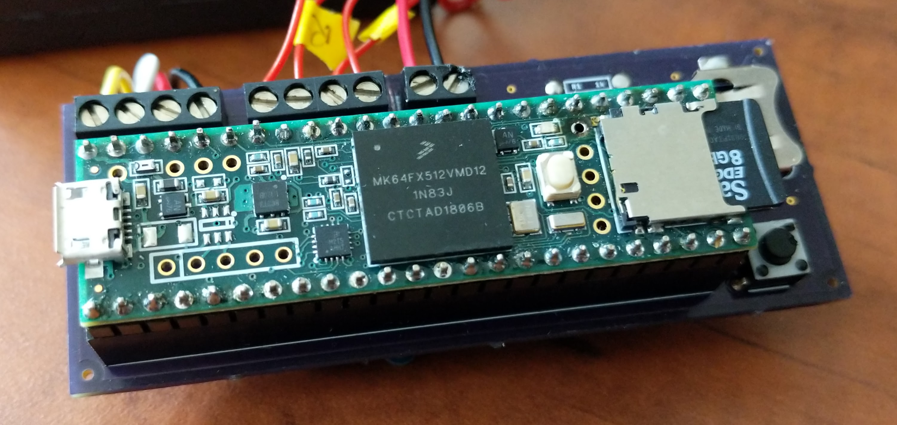

--- 
title: 'CHEM 191 Workbook: Building a Teensy Air Quality Monitor'
author: "Al Fischer"
date: "Western Carolina University"
output:
  html_document:
    df_print: paged
description: 'Course Materials for CHEM 191: Issues in Environmental Chemistry'
documentclass: book
link-citations: yes
bibliography: book.bib
output_dir: docs
site: bookdown::bookdown_site
biblio-style: apalike
---

# {-}

<small>
*Copyright 2019 Al Fischer.  This work is released under the [CC-BY-NC-SA 4.0 license](https://creativecommons.org/licenses/by-sa/4.0/).*
</small>